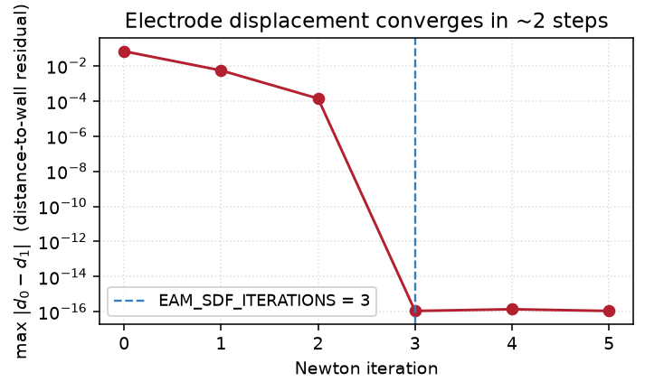

# Concepts & methods

The non-obvious algorithms behind the panels. Each maps to a module under
`ccdaf.core` / `ccdaf.interaction`.

## Seed geometry {#seed-geometry}

`ccdaf.core.seed_geometry.SeedGeometryResolver` turns a raw pick into a
deterministic vertex and validates it:

- **Snap** — nearest mesh vertex by a KD-tree (deterministic for a fixed point
  order).
- **Duplicate guard** — reject a pick within ~2% of the bounding-box diagonal of
  an existing seed.
- **PV prior** — a pulmonary-vein seed must sit on a *protrusion*: its geodesic
  distance from a body anchor (the vertex nearest the mesh centroid) must exceed
  a robust threshold. Body-wall picks fall below it and are rejected.

## Geodesic tagging & the snake {#geodesic}

Region tagging and the manual "snake" both work on the mesh **1-skeleton** (its
edge graph):

- **Automatic tagging** (`ccdaf.core.region_tagger`) grows each region outward
  from its seed along geodesics, capped by *radius factor × median edge length*.
- **The snake** (`ManualEditor` / `ClippingTool`) builds an **open geodesic**
  through user-dropped points, growing **bidirectionally** — each new point
  extends whichever endpoint (head or tail) reaches it by the shorter geodesic,
  so the path never doubles back. Committing tags the triangles incident to the
  path (manual) or clips inside the closed loop (PV contour).

## Picking {#picking}

All interactive picking uses VTK's **hardware (z-buffer) picker**
(`enable_point_picking(picker="hardware")`): it returns the front-most
*visible* surface hit, so a pick can never bleed through to an occluded
back-wall vertex.

- **Vertex tools** (seeds, snakes) snap the hit to the nearest vertex.
- **Cell tagging** maps the hit point to its triangle with
  `mesh.find_closest_cell` — the hit lies on a triangle *face*, so it resolves
  to exactly one cell (no vertex-sharing ambiguity).

## Electrode displacement {#electrode-displacement}

When the wall moves under a loaded mapping, electrodes are re-warped to preserve
their **signed distance to the wall** — an electrode 2 mm off the tissue stays
2 mm off it, on the same side. The default (`displace_electrodes_by_distance` in
`ccdaf.core.eam_loader`) needs **no** vertex correspondence between the two
surfaces, so it works even after a marching-cubes round trip.

Each electrode moves along the new wall's normal until the new wall is as far
away as the old one was:

```text
x  ←  x + (d0 − d1(x)) · ∇d1(x)
```

where `d0` is the (fixed) distance to the old wall, `d1` the distance to the new
wall, and `∇d1` its gradient. Because a signed distance field satisfies the
eikonal property `|∇d| = 1`, one step lands on the target distance to first
order; the residual is second-order (wall curvature) and negligible for the
sub-millimetre motion smoothing and reconstruction produce.

There is **no convergence loop** — the update `(d0 − d1)·∇d1` vanishes on its
own as the residual goes to zero, so a fixed `EAM_SDF_ITERATIONS = 3` is a safe
over-count:

{ width="440" }

Properties worth knowing:

- **Bounded** — no electrode moves further than the wall itself shifted.
- **Local by closest point** — an electrode tracks the piece of wall it is
  nearest to; a uniform wall offset moves every electrode with it.
- **Sign consistency** — both surfaces are re-wound outward first
  (`_outward`), so a Carto mesh and a flipped marching-cubes surface agree on
  which side is which, and electrodes are never driven through the wall.

Where this fires: the **Smooth** post-processing stage, **Clipping**, and the
segmentation **Export to VTK** round trip. It is a no-op when no mapping is
loaded. The RBF method `displace_electrodes` survives as a fallback for a
degenerate surface where the distance field faults.
