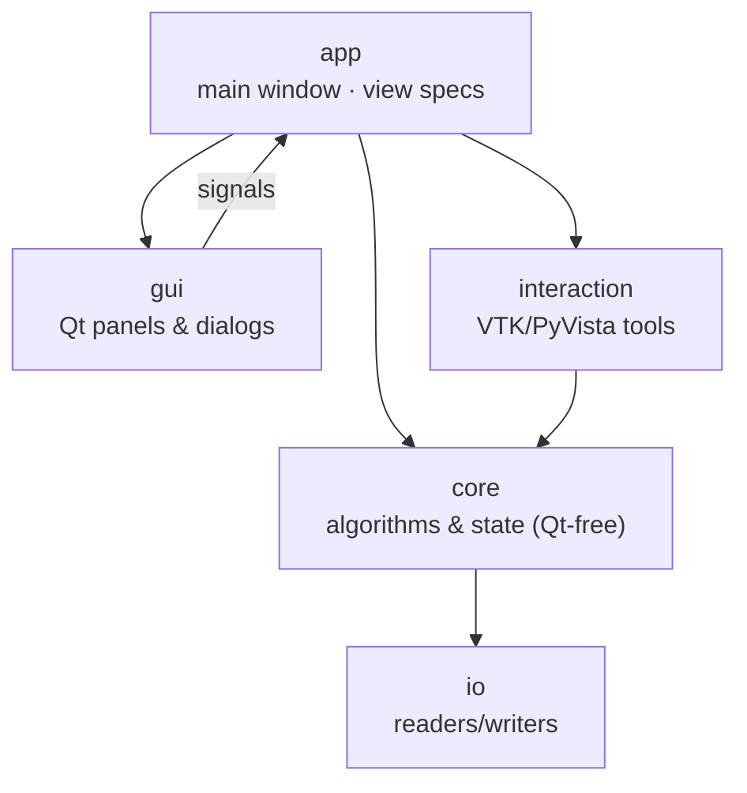
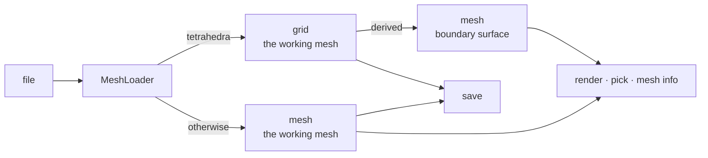

# Architecture

CCDAF separates **pure logic** from the **GUI**, so the algorithms are
headless-testable and Qt-free. The package lives under `src/ccdaf/`:

| Package | Responsibility |
|---|---|
| `ccdaf.core` | Pure algorithms and state: mesh load, region tagging, seed geometry/state machine, post-processing (surface and volumetric), field transfer, segmentation, EAM load/export, seed I/O. **No Qt, no VTK interaction** — unit-testable headlessly. |
| `ccdaf.io` | Low-level file readers/writers (`vtkfunctions`, `carto_functions`). |
| `ccdaf.interaction` | On-surface tools that own a picker: `seed_selector`, `manual_editor`, `clipping_tool`. Logic (state, geometry) is delegated to `core`; these add markers, HUD, and pick callbacks. |
| `ccdaf.gui` | Qt widgets — one panel per stage plus dialogs. Widgets expose **signals**; they hold no business logic. |
| `ccdaf.app` | The main window (`ccdaf.app.ccdaf.CCDAF`) wires widget signals to `core` / `interaction`, and `views` defines the window layouts. |

## Design principles

- **Signals up, calls down.** Widgets emit intent (`snake_commit_requested`, …);
  the app translates that into calls on `core`/`interaction`. Widgets never
  import `core`.
- **Logic is Qt-free.** Anything worth testing lives in `core` and is exercised
  by the headless suite. Interaction tools keep a thin, mockable plotter surface
  so their logic is testable too.
- **One view registry.** New window layouts are entries in `ccdaf.app.views.VIEWS`,
  not new code paths.

## Where things live

- The `X`-key routing and tool arbitration is in `ccdaf.app.ccdaf`.
- Picking uses VTK's hardware picker; see
  [Concepts → Picking](../concepts.md#picking).
- Electrode displacement is in `ccdaf.core.eam_loader`; see
  [Concepts → Electrode displacement](../concepts.md#electrode-displacement).

The full symbol-level documentation is generated from the docstrings in the
[API reference](../reference/index.md).

## Surfaces and volumes

The working mesh is one of two things, and `MeshLoader.kind` says which.
Deciding it is the cells' job, not the file's: a triangular surface stored as
an unstructured grid is a surface.

**The volume is the master and the surface is a view of it.** Anything that
changes geometry changes the volume and re-derives the surface, never the
other way round: re-deriving is cheap and always correct, while pushing a
changed surface back into a volume is not defined. That is the whole reason
the surface tools are switched off in volume mode — not that they could not
run, but that their result would have nowhere to go.

| Module | Kind | Notes |
|---|---|---|
| `core.volume_mesh` | both | the vocabulary: what a volume is, its boundary, orientation |
| `core.mesh_postprocessor` | surface | stages that rebuild a surface |
| `core.volume_postprocessor` | volume | one MMG3D pass, in memory; labels ride as element references |
| `core.field_transfer` | both | `transfer_fields` for surfaces, `transfer_volume_fields` for volumes |
| `core.volume_from_segmentation` | volume | cuts the working volume down to a corrected segmentation; refuses when the edit grew it |

`core.volume_postprocessor` is the one place that imports `mmgpy`, and it is
imported inside the call rather than at module scope, so the dependency is
paid for only by a session that remeshes.
