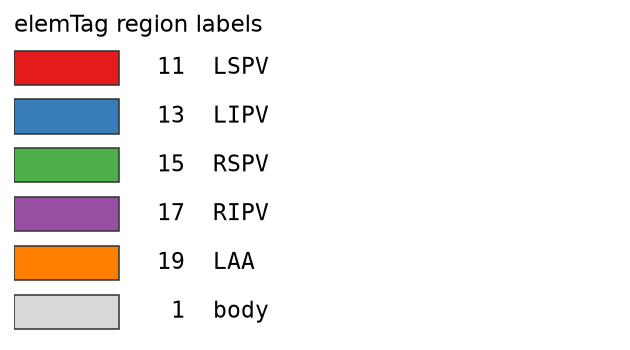

# File formats

## Region labels (`elemTag`)

Tags live in the mesh's `elemTag` **cell** array:

{ width="320" }

| Label | Region |
|---|---|
| 11 | LSPV |
| 13 | LIPV |
| 15 | RSPV |
| 17 | RIPV |
| 19 | LAA |
| 1  | body (background) |
| −1 | unassigned (internal; becomes body on *Accept tagging*) |

## Meshes — `.vtk`

Triangular surfaces are read/written through `ccdaf.io.vtkfunctions`.

- **Encoding:** legacy ASCII, legacy binary, and XML are supported. The project
  default on save is ASCII.
- **No-data / NaN:** binary and XML `.vtk` carry `NaN` natively. The legacy
  **ASCII** reader cannot parse a `nan` token — the first one trips the stream
  and every value after it misreads — so CCDAF writes a sentinel on ASCII export
  and restores it to `NaN` on import. If a downstream tool (e.g. ParaView) must
  read the file, prefer **binary** to keep `NaN` intact.

## Seeds — `.json` / `.pkl`

- **`.json`** — human-readable `{"seeds": {name: [x, y, z], ...}}`. Stores
  **coordinates only**, no vertex ids, so seeds reload onto a clipped or refined
  mesh (each snapped to the nearest surface point). The **landmarks_LA_UAC** set
  uses the same layout under its own `landmarks_LA_UAC` key.
- **`.pkl`** — the seeds alongside a Carto-dict surface.

## Session bundles — `.pkl`

A **File → Save** bundle packs the surface, tagging, seeds, LA-UAC landmarks
(under the `landmarks_LA_UAC` key) and electrodes together, so a session
round-trips in one file (`read_bundle` / write path in
`ccdaf.core.eam_loader`). Each seed set appears only when it has been
completed.

## EAM export

`ccdaf.core.eam_export` writes:

- **Binary** (`EXPORT_BINARY`) — a pickled `{'surface', 'electrodes'}`
  dictionary, as the reference Carto pipeline dumps.
- **VTK** (`EXPORT_VTK`) — the surface with every field, for ParaView.
  Electrodes are separate geometry and are **not** embedded in the VTK.

## Segmentation images — `.nii` / `.nii.gz`

Label images are read/written with SimpleITK. Surfaces are reconstructed with
marching cubes; see [Segmentation](user-guide/segmentation.md).
