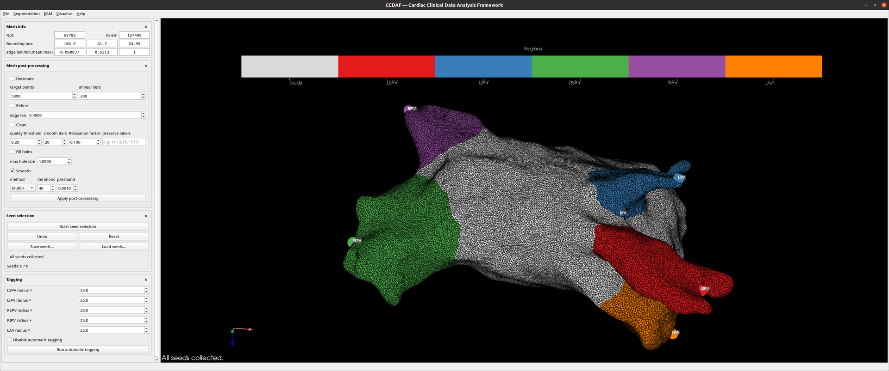

# Getting started

This tutorial walks the **happy path**: from a raw surface mesh to a tagged,
clipped result. Each step maps to a side panel; the full detail is in the
[User guide](user-guide/index.md).

!!! tip "The one shortcut to remember"
    Many tools commit with the **`X`** key over the 3D view: it commits a
    selection batch, and drops a point for the geodesic *snake* tools. See
    [Keyboard & mouse](shortcuts.md).

<figure markdown="span">
  
  <figcaption>The main window: the 3D viewport with the side-panel column and menubar.</figcaption>
</figure>

## 1. Load a mesh

**File → Load** and pick a `.vtk` surface. It appears in the 3D view; the
**Mesh info** panel reports point/cell counts and available fields. Untagged
cells start as *body*.

## 2. Place the six seeds

Open **Seed selection → Start seed selection** and click, in order:

`LSPV → LIPV → RSPV → RIPV → LAA → MV`

Each click snaps to the nearest visible surface vertex and the prompt advances.
Use **Undo** to re-pick the last one. Save them with **Save seeds…** — they are
stored as names + coordinates, so they reload onto a clipped or refined mesh.

## 3. Tag the regions automatically

In **Tagging**, set the per-region radius factors if needed, then
**Run automatic tagging**. CCDAF grows each pulmonary vein and the appendage as
a geodesic region from its seed and writes the labels into `elemTag`.

{ width="320" }

<figure markdown="span">
  
  <figcaption>The atrium coloured by region after automatic tagging.</figcaption>
</figure>

## 4. Correct labels by hand

In **Manual correction**, choose the active **Label**, then either:

- **Activate selection mode** and click triangles to build a batch, then press
  **`X`** to commit them; or
- toggle **Snake tag**, press **`X`** to drop points, and **Commit snake** to
  tag every triangle along the geodesic through them.

**Fill Holes**, **Smooth active label**, and multi-level **Undo** are here too.
Finish with **Accept tagging** (unassigned cells become body).

## 5. Clip the veins and valve

In **Clipping**, tick **Clipping active** (this hands the `X` key to clipping),
then:

- **PV:** pick a vein, **Start PV contour**, drop points with `X`,
  **Close & Clip PV**.
- **Mitral:** **Mitral: sphere** or **Mitral: plane**, position the widget,
  **Apply clip**. **Reject / revert clip** undoes it.

## 6. Export

**File → Save** writes the mesh (with tags, seeds, and — if a mapping is
loaded — electrodes). For EAM, **EAM → Export** writes a Carto binary bundle or
a VTK. See [File formats](file-formats.md).

---

Next: the **[User guide](user-guide/index.md)** covers every panel, and
**[Concepts & methods](concepts.md)** explains what happens under the hood.
