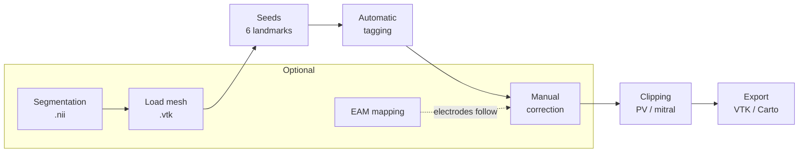

# CCDAF

  

**CCDAF** (Cardiac Clinical Data Analysis Framework) is a desktop GUI for
post-processing **left-atrial surface meshes** in cardiac electrophysiology
research: placing anatomical landmarks, tagging pulmonary-vein and appendage
regions, correcting labels by hand, clipping the veins and mitral valve, and
carrying electro-anatomical mapping (EAM) data across every surface change.

!!! danger "Not for clinical use"
    CCDAF is intended for **research purposes only** and has not been validated
    for clinical decision-making.

## What it does

- **Load** triangular surface meshes (`.vtk`).
- **Place** six anatomical seed points — LSPV, LIPV, RSPV, RIPV, LAA, MV.
- **Tag** pulmonary-vein and left-atrial-appendage regions automatically
  (geodesic region growing), then **correct** labels by hand with undo.
- **Clip** the PV ostia (contour snake) and the mitral valve (sphere or plane).
- **Post-process** mesh quality (decimate, refine, clean, smooth).
- Work with **EAM mappings**: load Carto maps, display fields and electrodes,
  and export to VTK or a Carto binary bundle — with electrodes that
  automatically **follow the wall** whenever the surface moves.
- A parallel **segmentation** workflow builds a surface from `.nii` images
  (morphology, manual paint, marching cubes).

## Where to next

- New here? Start with **[Installation](installation.md)** then the
  **[Getting started](getting-started.md)** tutorial.
- Learn each panel in the **[User guide](user-guide/index.md)**.
- The not-obvious bits (labels, the geodesic snake, electrode displacement,
  picking) are in **[Concepts & methods](concepts.md)**.
- Extending the code? See **[Architecture](developer/architecture.md)** and the
  **[API reference](reference/index.md)**.

---

   
  <em>Developed by the <a href="https://cemrg.com">Cardiac Electro-Mechanics Research Group (CEMRG)</a>.</em>

