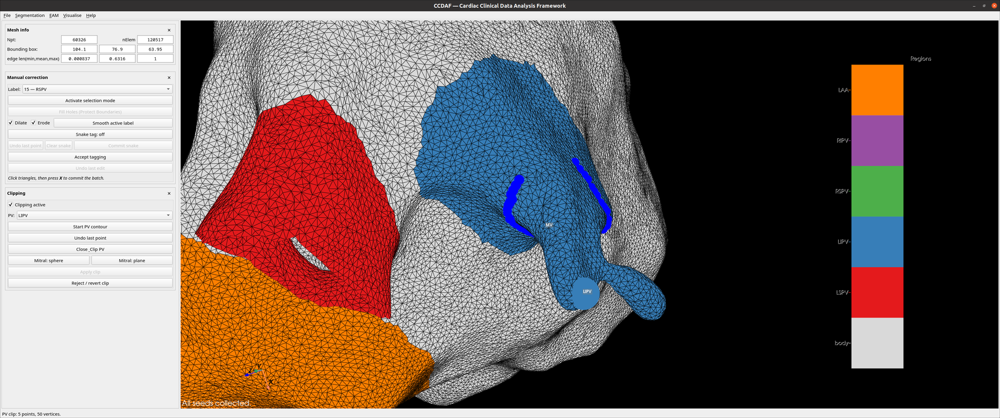
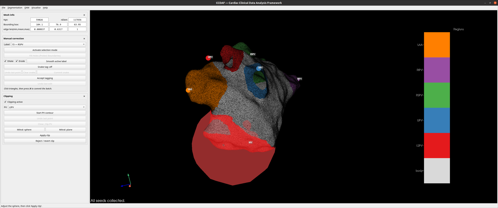

# Clipping

Remove the pulmonary-vein cuffs and open the mitral valve.

!!! note "The `X` key belongs to whoever is active"
    Clipping's snake and manual correction both use `X`. Tick **Clipping
    active** to hand the key to clipping; untick it to give it back to manual
    correction. Only one tool owns `X` at a time.

## Getting in

Clipping works on an accepted tagging, and the panel reaches that on its own:

- A mesh that arrives **already tagged** — reloaded from an earlier session,
  say — opens clipping the moment it loads. Starting a session at this step is
  a click on **Clipping active** and nothing more.
- Otherwise, ticking **Clipping active** accepts the tagging for you. If
  accepting would change the tags — a pending selection batch to commit, or
  triangles still unassigned that would become body — you are asked first,
  because that body fill is not on the undo stack. Decline and the tick is
  withdrawn, so the box never sits ticked over greyed-out controls.

**Accept tagging** in the manual-correction panel does the same thing, and is
still the way to finish tagging deliberately.

!!! note "Stray label cells are repaired without asking"
    Both routes reduce each region to a single connected patch, reassigning
    any cell of a label that got stranded away from its main patch — a label
    split in two is rejected on export. This is a repair rather than a choice,
    so it is not part of the question; the status bar reports how many cells
    it moved.

## The panel

Every clip is the same three choices, in this order:

1. **Region** — the anatomical point being clipped: `LSPV`, `LIPV`, `RSPV`,
   `RIPV` or `MV`.
2. **Mode** — how to cut it: **Contour**, **Sphere** or **Plane**.
3. **Start** → place it → **Apply clip**.

`MV` and **Contour** cannot be combined, and the panel greys the pairing out
rather than letting you press Start into an error: the contour snake walks a
tagged surface region, and the mitral valve is deliberately not tagged. Clip it
with a sphere or a plane.

The three buttons mean whatever the region and mode say they mean:

| Button | Contour | Sphere / plane |
|---|---|---|
| **Start** | Begin the snake on that region's tag | Raise the widget — where it was last left for this region, or at the region's seed the first time |
| **Undo / reset** | Remove the most recently placed point | Put the widget back at the region's seed default |
| **Apply clip** | Close the loop and clip the cuff inside it | Commit the pending clip |

**Revert clip**, below them, is the mesh-level undo: it discards a clip in
progress, or steps back through applied clips one at a time.

Changing **Region** or **Mode** while a clip is in progress re-points that
clip: a sphere or plane is raised again on the new selection, so what you see
always matches what the panel says. Switching to *Contour* drops the widget and
waits for **Start** — a contour needs picks, so it never begins on its own.
Nothing is lost by switching, because each region and mode remembers its own
placement.

## Contour (snake)

Clip a vein by drawing a closed loop around its ostium:

1. Pick the vein in **Region** and set **Mode** to *Contour*. The snake is
   confined to that tag's region.
2. **Start**.
3. Press **`X`** to drop points; a geodesic contour follows on that tag and
   grows bidirectionally.
4. **Undo / reset** removes the most recent point.
5. **Apply clip** closes the contour into a loop and clips off the cuff inside
   it.

A point is only taken when the **triangle under the cursor** carries the
selected vein's tag — a press on a neighbouring vein, on the body, or off the
surface altogether is refused, and the status bar says which tag it found.
Points on the rim of the region are refused too: the contour needs vertices
inside the tag to travel on.

<figure markdown="span">
  
  <figcaption>A PV contour: the geodesic snake tracing the vein ostium.</figcaption>
</figure>

## Sphere and plane

Both widgets are placed on the **selected region's seed**, so that seed has to
exist first — **Start** says so if it does not. They work on any region, not
just the mitral valve: a vein whose ostium the snake cannot follow cleanly can
be taken with a sphere instead.

- **Sphere** — **left-drag** it to move, **right-drag** to resize. **Apply
  clip** removes every triangle whose centre falls inside it.
- **Plane** — an arrow through a box with a ball at its centre. **Left-drag the
  arrowhead** to tilt it, **the rim** (where the plane meets the box) to slide
  it along the arrow, and **the centre ball** to shift it sideways;
  **middle-drag** moves it freely. **Apply clip** removes the seed's side.

!!! warning "Drags that start on the widget do not move the camera"
    Right-drag normally dollies the view, but over the plane widget it resizes
    the widget's bounding box — which changes nothing about the clip. Start
    the drag off the widget to move the camera.

!!! note "A plane through its own seed is ambiguous"
    The seed decides which half goes, so a plane sitting exactly on it cannot
    say. Slide the plane off the seed before **Apply clip**; the status bar
    asks you to if you have not, and the clip stays pending — the plane is
    still there to move and apply again.

### The numbers

Below the buttons the panel shows the live geometry — the sphere's **centre**
and **radius** (with the diameter beside it), or the plane's **centre** and
**normal**. They track the widget as you drag it.

The boxes are **editable**: type a radius and the sphere resizes to it, type a
centre and it moves there. A clip can be repeated at a measured size rather
than eyeballed, and one set on one case can be reproduced on the next.

<figure markdown="span">
  
  <figcaption>Clipping the mitral valve with the adjustable sphere widget.</figcaption>
</figure>

## Apply, reset and revert

- **Apply clip** commits the pending clip to the mesh.
- **Undo / reset** works *inside* a clip: one contour point back, or the
  sphere/plane returned to the seed default. It never touches the mesh.
- **Revert clip** works *on* the mesh: it discards a clip in progress, or
  undoes applied clips one at a time, newest first (each clip snapshots the
  mesh before it runs).

!!! tip "A reverted clip does not cost you the placement"
    The sphere or plane you were using is remembered per region. Revert a clip
    you are not happy with, press **Start** again, and it comes back exactly
    where you left it — nudge it and re-apply rather than positioning it from
    scratch. **Undo / reset** is the way back to the seed default when you do
    want to start over, and a newly loaded mesh always starts there.

!!! tip "Electrodes follow the clip"
    Clipping changes the surface, so a loaded mapping's electrodes are carried
    across automatically — see
    [Concepts → Electrode displacement](../concepts.md#electrode-displacement).
