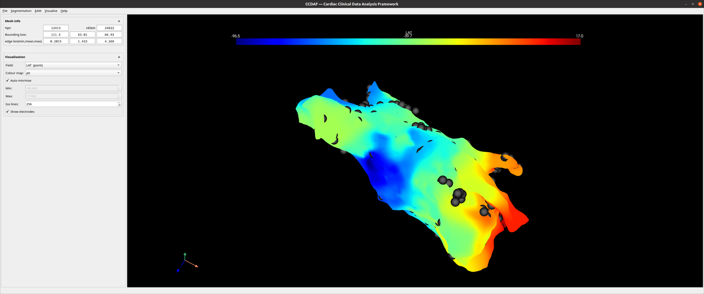

# EAM & visualisation

## Loading an EAM mapping

**EAM → Load** reads a Carto mapping (`<map_name>.mesh` + electrodes) and adopts
its surface as the working mesh. The surface arrives with its point-data fields
(bipolar/unipolar voltage, LAT, …) and a set of **electrode** positions drawn as
spheres.

CCDAF's guarantee: whenever the surface later moves — smoothing, clipping, a
segmentation round trip — the electrodes are re-warped to keep their
distance-to-wall, on the same side. The method is in
[Concepts → Electrode displacement](../concepts.md#electrode-displacement).

## Exporting

**EAM → Export** writes either:

- **Binary** — a pickled `{'surface', 'electrodes'}` bundle, as the reference
  Carto pipeline consumes; or
- **VTK** — the surface with every field, for ParaView (electrodes are separate
  geometry and are not embedded).

The dialog also offers an **ASCII** VTK option (text rather than binary; VTK
only — a pickle has no text form). See [File formats](../file-formats.md).

## Visualisation panel

<figure markdown="span">
  
  <figcaption>A mapping rendered by field, with electrode positions shown.</figcaption>
</figure>

Controls how the mesh is coloured:

- **Field** — which point-data field to project onto the surface.
- **Colour map** — the colour map used to render it.
- **Auto min/max** — take the colour range from the field's own data range; when
  off, set **Min** / **Max** by hand.
- **Iso lines** — number of discrete colour bands.
- **Show electrodes** — draw the mapping's electrode positions (greyed until a
  mapping with electrodes is loaded).

The **Visualise** menu and the **Display** options control which overlays
(points, projected points, slices) are shown.
