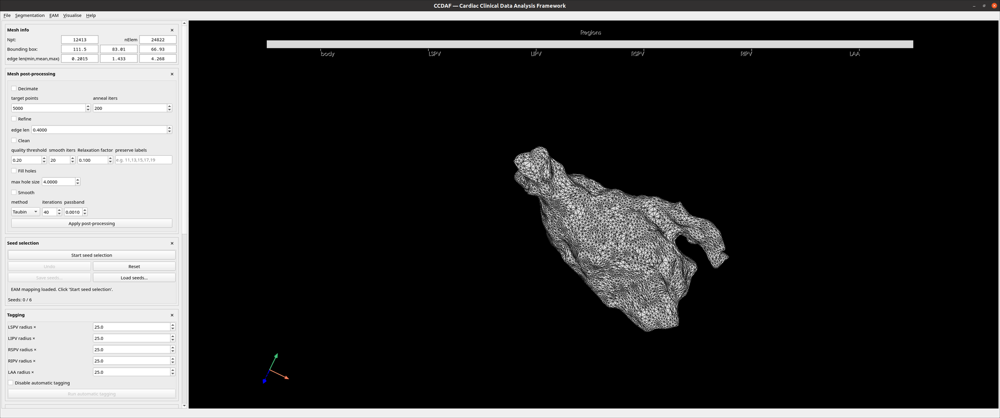

# User guide

CCDAF is organised as a **3D viewport** with a column of collapsible **side
panels**, one per stage of the workflow. The menubar carries **File**,
**Segmentation**, **EAM**, and **Visualise** menus.

Most panels stay disabled until the step before them is done — you place seeds
before tagging, tag before clipping, and so on.

<figure markdown="span">
  
  <figcaption>The 3D viewport, the collapsible side panels, and the menubar.</figcaption>
</figure>

## The panels

| Panel | Purpose | Page |
|---|---|---|
| Mesh info | Point/cell counts, fields, labels present | [Loading & mesh info](loading.md) |
| Mesh post-processing | Decimate / refine / clean / fill / smooth | [Post-processing](post-processing.md) |
| Seed selection | Place the six anatomical landmarks | [Seeds & tagging](seeds-tagging.md) |
| Tagging | Automatic geodesic region tagging | [Seeds & tagging](seeds-tagging.md) |
| Manual correction | Fix labels by triangle picking or a geodesic snake | [Manual correction](manual-correction.md) |
| Clipping | Clip PV ostia and the mitral valve | [Clipping](clipping.md) |
| Segmentation | Build a surface from a `.nii` image | [Segmentation](segmentation.md) |
| Visualisation | Choose the field, colour map, range, electrodes | [EAM & visualisation](eam-visualisation.md) |

## Views

The window has two layouts (`ccdaf.app.views`):

- **General** — a single 3D view for the mesh workflow.
- **Segmentation** — a 2×2 layout (three orthogonal slices + a 3D preview) used
  while editing a voxel volume.

## Interacting with the 3D view

- **Left-drag** rotates, **scroll** zooms, **right-drag/​middle-drag** pan/zoom
  (standard VTK trackball).
- **Left-click** picks (seeds, triangle selection).
- **`X`** commits the current tool's batch or drops a snake point — see
  [Keyboard & mouse](../shortcuts.md).

Every hoverable control carries a tooltip; hover to see what it does.
