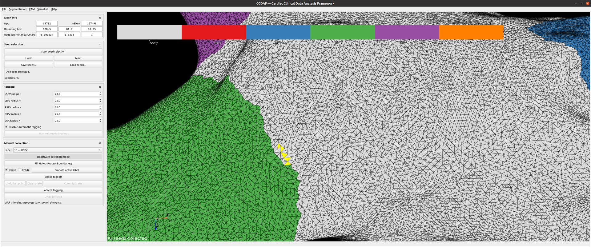
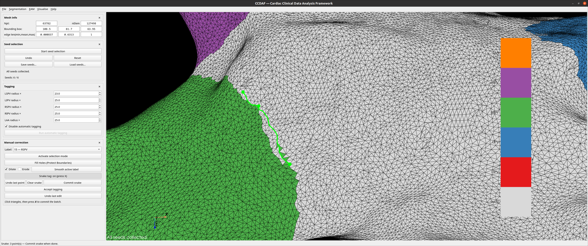

# Manual correction

Fix the `elemTag` labels after automatic tagging. Pick the **active Label**
(the PV/LAA regions or *body*) at the top; every tool below applies that label.

The two picking tools are **mutually exclusive** — turning one on turns the
other off, because both drive the surface picker. So do
[seed selection](seeds-tagging.md) and the [PV contour clip](clipping.md): only one
tool holds the picker at a time, and starting either mode here stops whichever
had it (the status bar says which). Seeds and pending selections survive; a PV
contour in progress does not.

## Selection mode

- **Activate selection mode**, then press **`X`** with the mouse over a
  triangle to add it to a pending yellow batch. Left-drag still only rotates
  the view, so aiming and picking never get confused.
- Press **`C`** to commit the batch to the active label.
- Changing the active label clears any pending batch (so batches never mix).

<figure markdown="span">
  
  <figcaption>Selection mode — picked triangles highlighted as a pending batch.</figcaption>
</figure>

## Snake tag (geodesic)

Tag a strip of triangles along a geodesic curve:

- Toggle **Snake tag: off → on**.
- Press **`X`** to drop points on the surface; the open geodesic between them is
  drawn live and grows bidirectionally from the nearer endpoint.
- **Undo last point** removes the most recent point; **Clear snake** discards
  them all.
- **Commit snake** tags every triangle touching the geodesic with the active
  label. The **body** label is supported here too.

<figure markdown="span">
  
  <figcaption>Snake mode — the open geodesic drawn live through the dropped points.</figcaption>
</figure>

## Cleanup & smoothing

Both act on the whole mesh rather than on a picked batch, so they are available
whenever manual correction is — with selection mode on **or** off.

- **Fill Holes (Protect Boundaries)** — fills unassigned triangles by region
  growing while keeping existing region boundaries separate, so neighbouring
  labels do not merge.
- **Smooth active label** with the **Dilate** / **Erode** checkboxes — one pass
  per click. Dilate grows the label into its jagged fringe; Erode shaves spikes;
  both together run dilate-then-erode, which de-jags with little net growth.

!!! info "Smoothing **body** smooths every region at once"
    Body is the background, so it has no boundary of its own — its boundary
    *is* the region boundaries, seen from the other side. It still smooths like
    any other label, and the checkboxes keep their usual meaning:

    - **Dilate** grows body, which is every PV label eroding one pass;
    - **Erode** shrinks body, which is every PV label dilating one pass.

    All five labels move together against one snapshot of the mesh, so the
    result does not depend on the order the labels are stored in, and the seam
    guard still applies: a triangle caught between two regions is claimed by
    neither, so smoothing can never merge them.

## Finishing & undo

- **Undo last edit** reverts the last committed batch (up to 3 levels).
- **Accept tagging** commits any pending batch and assigns **body** to every
  still-unassigned triangle, ending the correction stage.
