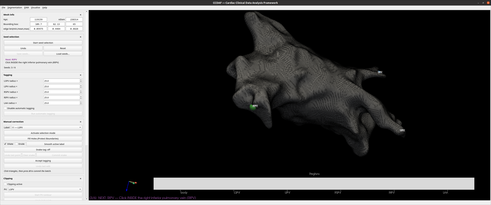

# Seeds & tagging

## Seed selection

The **Seed type** dropdown at the top of the panel chooses which set of
surface points you are placing:

- **seed** (default) — the six anatomical landmarks below that drive region
  tagging. Exported under the `seeds` key.
- **landmarks_LA_UAC** — four left-atrium landmarks for a universal-atrial-
  coordinate step: `LSPV_BODY_JCN`, `RSPV_BODY_JCN`, `SEPTAL_WALL`,
  `LATERAL_WALL`. Picked, saved and exported exactly like seeds, but under the
  `landmarks_LA_UAC` key, and **not** used for tagging.

The two sets are independent: you can complete both in one session — switching
the dropdown keeps each set's picks — and a saved bundle can carry both keys at
once. The rest of this section describes the default **seed** set.

Tagging needs six anatomical landmarks, placed **in order**:

| # | Seed | Meaning |
|---|---|---|
| 1 | LSPV | Left superior pulmonary vein |
| 2 | LIPV | Left inferior pulmonary vein |
| 3 | RSPV | Right superior pulmonary vein |
| 4 | RIPV | Right inferior pulmonary vein |
| 5 | LAA  | Left atrial appendage |
| 6 | MV   | Mitral valve (centre) |

**Start seed selection**, then click each landmark on the surface. The heads-up
prompt shows which seed is next. Each pick:

1. snaps to the nearest **visible** surface vertex (hardware picking — no
   bleed-through to the far wall);
2. is rejected if it is too close to an existing seed;
3. for the PV seeds, is checked against an anatomical prior (the pick must sit
   on a protrusion — see [Concepts](../concepts.md#seed-geometry)).

Controls:

- **Undo** removes the last seed so you can re-pick it.
- **Reset** clears all seeds — the way to start the set over.
- **Start seed selection** normally begins a fresh set. The exception is when
  another tool interrupted this one (see
  [Troubleshooting](../troubleshooting.md#a-tool-switched-itself-off-when-i-started-another-one)):
  then it resumes where it stopped, keeping the seeds already placed.
- **Save seeds… / Load seeds…** — seeds are stored as names + coordinates (no
  vertex ids), so they reload onto a clipped or refined mesh, each snapped to
  the current surface by nearest point.

<figure markdown="span">
  
  <figcaption>Seed placement — markers on the surface with the next-seed prompt.</figcaption>
</figure>

## Automatic tagging

Once the seeds are in, the **Tagging** panel grows each region as a **geodesic
region** from its seed and writes the labels into `elemTag`.

- **Radius factors** — a per-region cap on how far each region grows, expressed
  as *factor × median edge length*. Each vein has its own factor and the LAA has
  a larger default (it is a lobed pouch that expands more than the vein tubes).
- **Disable automatic tagging** — a guard that greys out the run button to
  prevent accidental re-runs.
- **Run automatic tagging** — performs the tagging.

The regions and their labels:

{ width="320" }

<figure markdown="span">
  
  <figcaption>The tagged atrium — each region in its label colour.</figcaption>
</figure>

After tagging, refine the result in [Manual correction](manual-correction.md).
