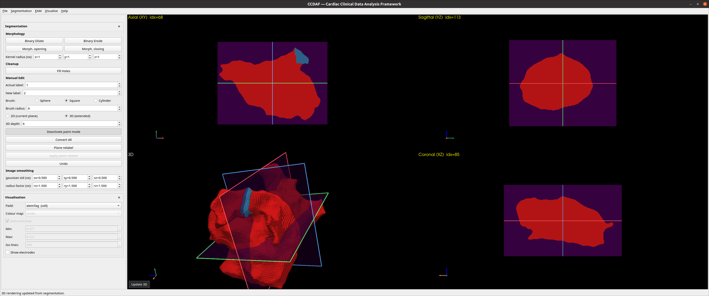

# Segmentation

The segmentation workflow builds a surface from a **label image** (`.nii` /
`.nii.gz`) instead of loading a mesh. It opens the **2×2 segmentation view**
(three orthogonal slices + a 3D preview).

Open it from **Segmentation → Load**; export the result with
**Segmentation → Export to VTK…**.

A label image stored in an orientation other than `LPS` is re-indexed on load
so the slices, the brush and the 3D preview agree on where each voxel is; the
status bar says so, and saving writes the original orientation back. See
[Segmentation images](../file-formats.md#segmentation-images-nii-niigz).

<figure markdown="span">
  
  <figcaption>The segmentation view: three orthogonal slices plus a 3D preview.</figcaption>
</figure>

## Morphology

Binary operations on the voxel labels, using the per-axis **kernel radius**
(voxels) below them:

- **Binary Dilate / Erode** — grow / shrink labelled regions.
- **Morph. opening** (erode → dilate) — remove small specks.
- **Morph. closing** (dilate → erode) — fill small holes.

## Cleanup

- **Fill Holes** — fill fully-enclosed holes in the segmentation.

## Manual edit (paint)

Repaint voxels interactively:

- **Actual label** / **New label** — only voxels matching *Actual* are changed,
  and become *New*.
- **Brush** — Sphere / Square / Cylinder, with a **Brush radius** (voxels).
- **2D** paints in the current slice; **3D** paints through several slices (see
  **3D depth**).
- **Activate paint mode**, then drag on a slice.
- **Convert All** relabels every *Actual* voxel to *New* at once.
- **Plane relabel** shows an orientable plane; **Apply plane relabel** converts
  *Actual* → *New* only on the side the normal points to (an oblique cut the
  axis planes cannot make).
- **Undo** reverts the last segmentation edit.

## Image smoothing → surface

Two per-axis parameter rows control the marching-cubes surface:

- **gaussian std (vx)** — Gaussian pre-smoothing standard deviation.
- **radius factor (vx)** — Gaussian kernel size.

Then:

- **Update 3D** (button over the 3D quadrant) — rebuilds the preview surface
  from the current volume and smoothing parameters. **Rendering only** — it does
  not create a working mesh.
- **Segmentation → Export to VTK…** — runs marching cubes with the same
  parameters, adopts the result as the working mesh, and (if this segmentation
  came from a mesh loaded here) carries its fields and electrodes onto the new
  surface.

!!! warning "Electrodes and the two paths"
    **Export to VTK** recomputes electrode positions onto the reconstructed
    surface; **Update 3D** is a preview and does not. See
    [Concepts → Electrode displacement](../concepts.md#electrode-displacement).
