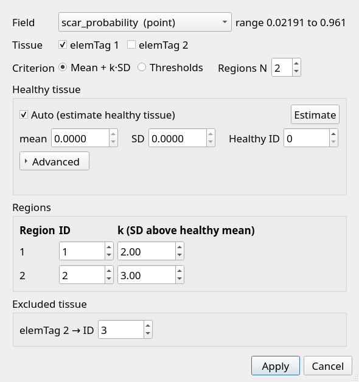
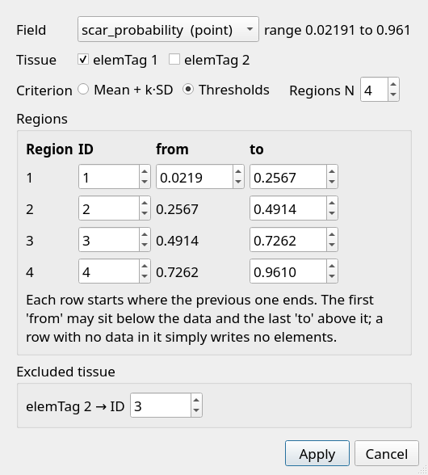

# Tissue properties

**Actions → Assign tissue property…** marks every element of the working mesh
with a material region read off a scalar field (a late-enhancement intensity, a
voltage, a probability) and writes the result as `tissueTag`, an integer cell
array. A simulation assigns conductivities and cell models by it, so every
element gets an ID and no ID is negative.

The item is available when the mesh has an `elemTag` array and at least one
scalar floating-point field, and no segmentation is open. When it is greyed
out, its tooltip says which of those is missing. It works on surfaces and on
tetrahedral volumes alike; on a volume the tags go on the tetrahedra.

<figure markdown="span">
  
  <figcaption>Mean + k·SD on a ventricle: the left ventricle is classified and
  the right ventricle, which carries no LGE, is excluded with its own ID.</figcaption>
</figure>

## The dialog

| Control | What it does |
|---|---|
| **Field** | The field to read. Only one-component floating-point fields with data are listed; `elemTag`, `tissueTag` and vector fields such as `fiber` never are. A point field is averaged to each element's centre over its vertices with data. The range shown is the field's range in the ticked tissue. |
| **Tissue** | One box per `elemTag` value. Ticked tissue is classified, and it is the only tissue the statistics use. Unticked tissue is excluded and written with its own ID. |
| **Criterion** | *Mean + k·SD* or *Thresholds*. |
| **Regions N** | The number of region rows, 1 to 10. |

### Mean + k·SD

Region *i* starts at **healthy mean + kᵢ·SD** and runs up to where the next row
starts; the top region has no upper limit. Everything below the first row is
healthy and gets the **Healthy ID** (default 0). The defaults, k = 2 and 3,
give a border zone from 2 SD and scar from 3 SD above the healthy mean: the
definition of Chen et al. (2015), as restated by Mendonca Costa et al. (2019).

- **Auto (estimate healthy tissue)** — ticked, CCDAF finds the healthy tissue
  itself; see [How the healthy tissue is found](#how-the-healthy-tissue-is-found).
  **Estimate** runs it without writing anything and fills in the mean and SD.
  Unticked, you type the mean and SD.
- **Advanced** — the estimate's settings: **seeds percentile** (default 25),
  **growth limit m** (default 3) and **stop below % change** (default 0.1).
- Each row has an **ID** (default 1 to N) and a **k**. The k values must
  increase from row to row.

!!! warning "Typed values must be on this field's scale, per element"

    The mean and SD you type are compared with each element's value, so they
    must come from the same field, per element. Measured on the same healthy
    tissue of the example ventricle, the SD over vertex values is 0.063 and over
    element values 0.057, because averaging four vertices smooths. Typing the
    vertex values would move scar from 14.0% to 12.6%. Values measured on the
    image, or on a field rescaled differently, differ further.

### Thresholds

Each row covers **from ≤ value < to**; the last row also includes its *to*.
You type the first row's *from* and every row's *to*. Each later row starts
where the previous one ends, so rows can neither leave a gap nor overlap.

The first *from* may sit below the data and the last *to* above it. A row with
no data in it is valid: its ID simply appears on no element. The rows start
evenly spaced over the data range, and are reset to it when you change the
field or the tissue.

<figure markdown="span">
  
  <figcaption>Four threshold rows. Each row's <em>from</em> is the previous
  row's <em>to</em>, so a gap or an overlap cannot be typed.</figcaption>
</figure>

### Excluded tissue

Every unticked `elemTag` value gets an ID box. It starts at the `elemTag`
number itself when that number is free, and otherwise at the smallest unused
number. On a two-row classification of a ventricle, for example, the right
ventricle (`elemTag` 2) would clash with scar (ID 2), so it starts at 3.
Excluded tissues may share an ID with each other, for example all four veins
as one material.

## How the healthy tissue is found

The published definition takes the healthy mean and SD from a remote region an
observer draws on the image. A mesh has no observer, and deciding what is
healthy is the very thing being computed, so **Auto** estimates it:

1. **Seeds**: the elements at or below the 25th percentile of the field.
2. **Grow**: from the seeds, through neighbouring elements, keep everything at
   or below **mean + 3·SD** of the region so far. Recompute and grow again from
   the seeds.
3. **Stop** when a round changes the region by less than 0.1% of the tissue.

The final region's mean and SD are the healthy reference. Every statistic is
weighted by element volume (or area, on a surface). See
[Concepts → Healthy-tissue estimate](../concepts.md#healthy-tissue-estimate)
for why it works this way and where it stops working.

!!! tip "Untick tissue that carries no signal"

    Masked tissue, such as a right ventricle whose LGE is exactly 0, must not be
    ticked. Its zeros become every seed, the healthy SD comes out as 0, and
    Apply refuses. Even a smaller share of masked values skews the result, which
    is why one exact value covering more than 5% of the tissue triggers a
    warning.

## No data

An element whose vertices all lack data (a Carto map's unmeasured points, for
instance) takes the value of its nearest element with data, measured through
neighbouring elements of the ticked tissue, so a value is never borrowed from
the opposite wall. The fill happens after the healthy statistics, which use
measured elements only, and it never changes the field itself. The status
message says how many elements were filled.

## Checks before writing

Apply refuses, with a message, when:

- no tissue is ticked, or the field has no values in the ticked tissue;
- the k values do not increase, or the first k is not above 0;
- a typed mean or SD is not a number, or the SD is not above 0;
- two region rows share an ID, or the healthy ID equals a region ID;
- a threshold row's *to* is not above its *from*, or the rows do not cover the
  data in the ticked tissue;
- the healthy tissue has no spread (SD = 0), usually masked tissue ticked;
- an element with no data has no connected element with data to take a value
  from.

It asks before writing when:

- one exact value covers more than 5% of the ticked tissue (masked or clipped
  data);
- the estimated healthy tissue is less than half of the ticked tissue (right
  for a very large infarct, but also what seeds reaching into scar produce);
- the estimate did not settle within 100 rounds;
- the seeds percentile is above 35;
- a typed mean lies outside the field's range in the ticked tissue;
- excluded tissue shares an ID with classified tissue;
- the mesh already has a `tissueTag`, which would be replaced.

There is no undo: Apply never changes the geometry, `elemTag` or the field, so
the only thing it can replace is a previous `tissueTag`, and it asks first.

## Worked example

On `examples/AJR5d03295_myo_scar_lge_masked_lvonly.vtk`, a ventricle whose LGE
intensity (rescaled to [0, 1]) is stored as `scar_probability`:

1. **Field** `scar_probability (point)`.
2. Untick **elemTag 2**, the right ventricle, which carries no LGE. Its ID
   starts at 3.
3. **Mean + k·SD**, N = 2, **Auto**, and **Apply**.

The estimate settles after 12 rounds with a healthy mean of 0.1315 and an SD
of 0.0565.

**Left-ventricle tissue by ID after Apply (share of LV volume)**

| ID | Region | Share |
|---:|---|---:|
| 0 | healthy | 81.5% |
| 1 | border zone (2 to 3 SD) | 4.5% |
| 2 | scar (3 SD and above) | 14.0% |

The right ventricle is written as ID 3. With it left ticked instead, Apply
refuses: its zeros make up every seed.

## Viewing and saving

After Apply, the Visualisation panel switches to `tissueTag` and draws it as
numbered regions. `tissueTag` is ticked in **File → Save data → Choose
fields** whenever the mesh has one. A VTK surface stores it as `float32`, as it
does `elemTag`, and CCDAF recognises it by name when reloading it. A `.pkl`
bundle keeps it too; see [File formats](../file-formats.md).

## References

- Chen Z, Sohal M, Voigt T, et al. Myocardial tissue characterization by
  cardiac magnetic resonance imaging using T1 mapping predicts ventricular
  arrhythmia in ischemic and non-ischemic cardiomyopathy patients with
  implantable cardioverter-defibrillators. *Heart Rhythm* 2015;12:792–801.
  [doi:10.1016/j.hrthm.2014.12.020](https://doi.org/10.1016/j.hrthm.2014.12.020)
- Mendonca Costa C, Neic A, Kerfoot E, et al. Pacing in proximity to scar
  during cardiac resynchronization therapy increases local dispersion of
  repolarization and susceptibility to ventricular arrhythmogenesis. *Heart
  Rhythm* 2019. [PMC6774764](https://pmc.ncbi.nlm.nih.gov/articles/PMC6774764/)
